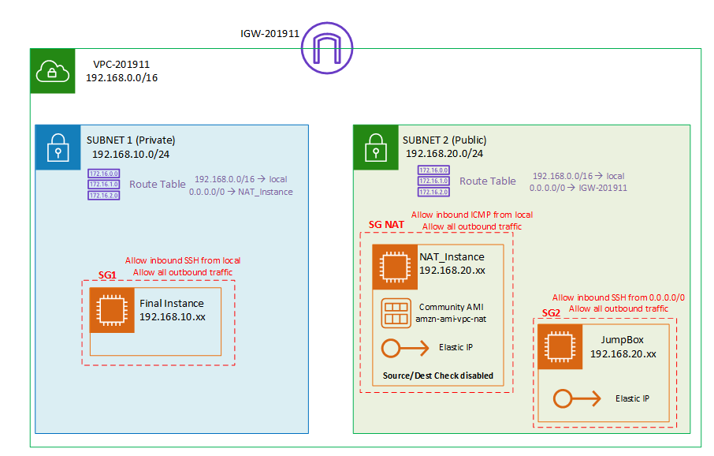
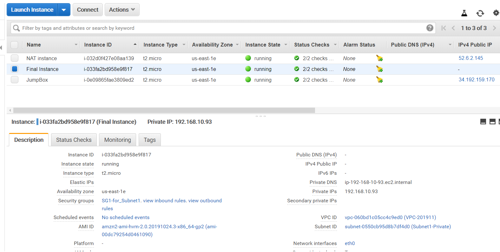
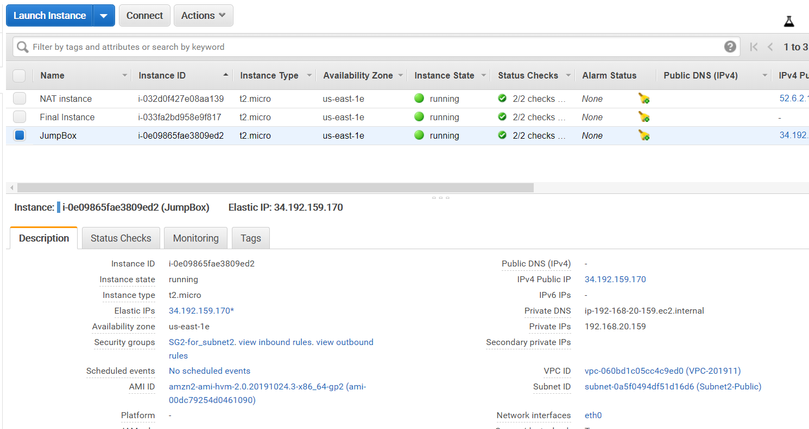
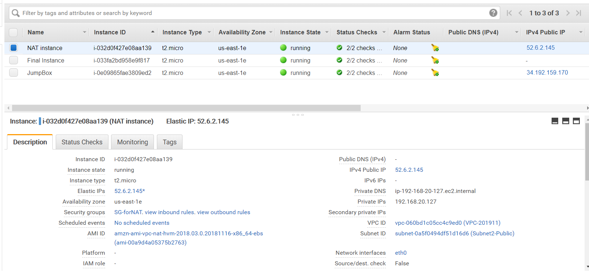
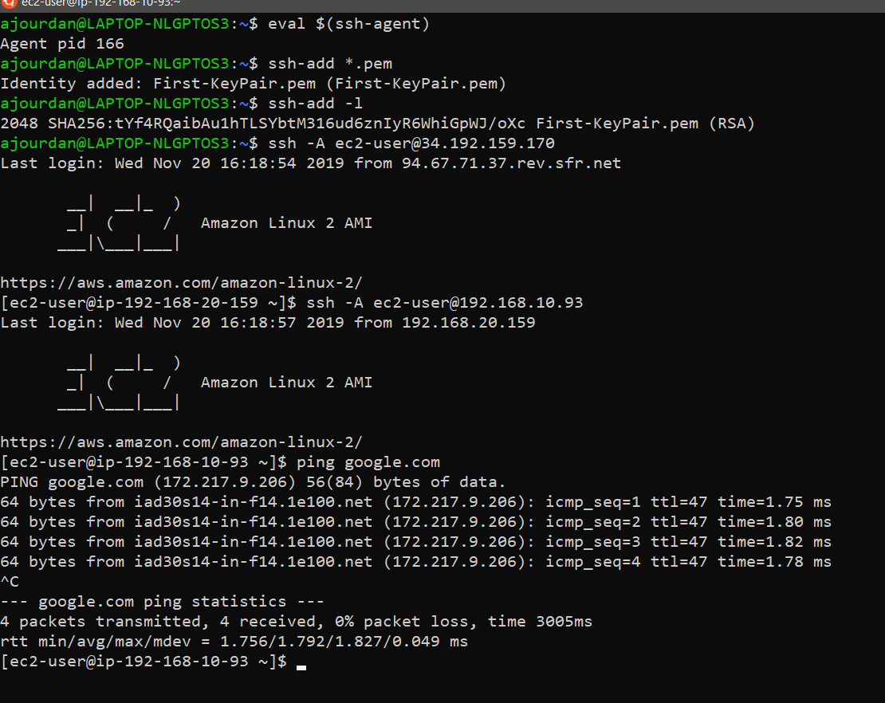

# AWS-Jumbox-Setup
JumpBox (also called Bastion)

## Principle: 

- Jumbox in **public** subnet
- Final Instance in **private** subnet
- **--> if JB is shut down - nobody can access EC2.**

## Architecture:



### VPC
- Subnet1 **Private**
	- Route table: main
		`-> add 0.0.0.0/0 to NAT instance`
- Subnet2 **Public**
	- Route table: RT-table 
		`-> add 0.0.0.0/0 to IGW`
- IGW

### EC2 Instances
- Final instance
	- belongs to Subnet1
	- SG1:
		> - allow Inbound SSH from local
		> - allow Outbound All traffic

- JumpBox
	- belongs to Subnet2
	- Elastic IP assigned
	- SG2:
		> - Allow inbound SSH from 0.0.0.0/0
		> - Allow Outbound All traffic
	
- NAT Instance (Use AMI community image: `amzn-ami-vpc-nat`)
	- belongs to Subnet2
	- Elastic IP assigned
	- `*!!! in Networking / Change Source/Dest Check --> Disable*`
	- SG-NAT:
		> - Allow inbound ICMP (Ping) from local 
		> - Allow Outbound All traffic

## Test Connection: (ping google.com from Final instance)

### SSH connection (copying ssh key to Jumbox)
- copy file using:
	
	```
	scp -i key.pem key.pem ec2-user@<Jumbox IP>:key.pem
	```
	
- Connect to Jumpbox:
	
	```
	ssh -i key.pem ec2-user@<JumpBox IP>
	```
	
- From JB, connect to Final instance
	
	```
	ssh -i key.pem ec2-user@<FI IP>
	```
	
- Test Ping Google.com -- **Works**

### SSH connection (using key agent):
- Configure key agent transfer
	```
	eval $(ssh-agent)
	
	ssh-add ---.pem
	
	ssh-add -l (to check list of added keys to agent)
	```
	
- Connect to Jumpbox:
	
	```
	ssh -A ec2-user@<JumpBox IP>
	```
	
- From JB, connect to Final instance
	
	```
	ssh -A ec2-user@<FI IP>
	```
	
- Test Ping Google.com -- **Works**

 
 
 
 

