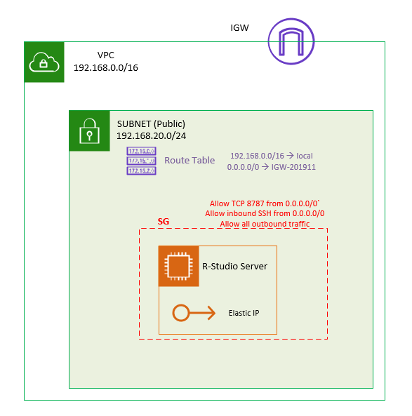
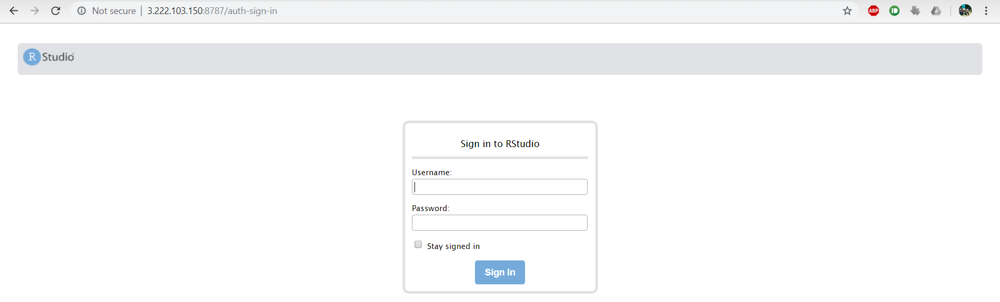
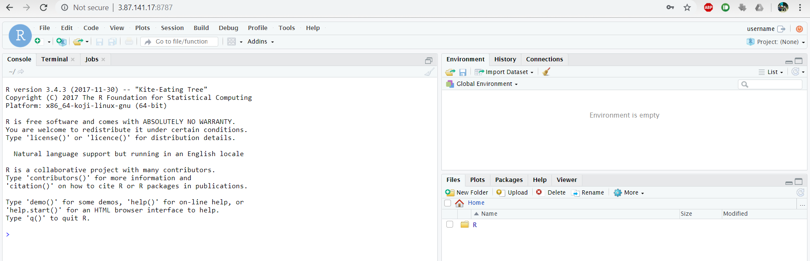
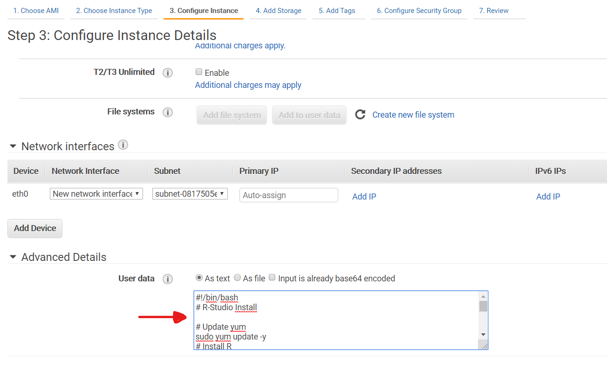

# AWS-Rstudio-Server-Setup


## Architecture

- VPC
  - Public subnet 
    - Route table: `--> add 0.0.0.0/0 to IGW`
  - IGW

- EC2 instance (AMI Amazon Linux 2: based on CentOS 6/7)

  - SG
    - **By default R-Studio Server runs on port 8787** : `--> Allow TCP 8787 from 0.0.0.0/0`

  - Elastic IP *(at least Public IP attached to instance)*



## SSH Connection

Connect in ssh to instance:

```bash
ssh -i key.pem ec2-user@<Public-IP>
```

## Install R-Studio server

 RStudio Server requires RedHat or CentOS version 6 (or higher) **as well as an installation of R** 

### Install R

```bash
sudo amazon-linux-extras install R3.4
```

should have been *(but doesn't work on this AMI gives code above to install R)*

```bash
sudo yum install -y R 
```

### Install R-Studio server

instructions for installing R-Studio Server:

 https://rstudio.com/products/rstudio/download-server/redhat-centos/ 

```bash
wget https://download2.rstudio.org/server/centos6/x86_64/rstudio-server-rhel-1.2.5019-x86_64.rpm
sudo yum install rstudio-server-rhel-1.2.5019-x86_64.rpm
```

Check installation *(should return nothing...)*

```bash
sudo rstudio-server verify-installation
```

### Start R-Studio server (if needed)

```bash
sudo rstudio-server start
```

## Add user and password 

```bash
sudo useradd username 
echo username:password | sudo chpasswd

or
sudo passwd username
```

## Connect to R-Studio:

in browser: (using user and password set previously)

```
<Public-IP>:8787
```







## Installation process with a script (instance User data):

Do not forget -y in command line (confirms automatically)

```bash
#!/bin/bash

# R-Studio Server Install script

# Update yum
sudo yum update -y
# Install R
sudo amazon-linux-extras install R3.4 -y
# Install R-Studio Server
wget https://download2.rstudio.org/server/centos6/x86_64/rstudio-server-rhel-1.2.5019-x86_64.rpm
sudo yum -y install rstudio-server-rhel-1.2.5019-x86_64.rpm
# Start R-Studio
sudo rstudio-server start
# Add username and password
sudo useradd username 
echo username:password | sudo chpasswd

```




**<u>Useful extra AWS instructions:</u>**

​	 https://aws.amazon.com/fr/blogs/big-data/running-r-on-aws/ 