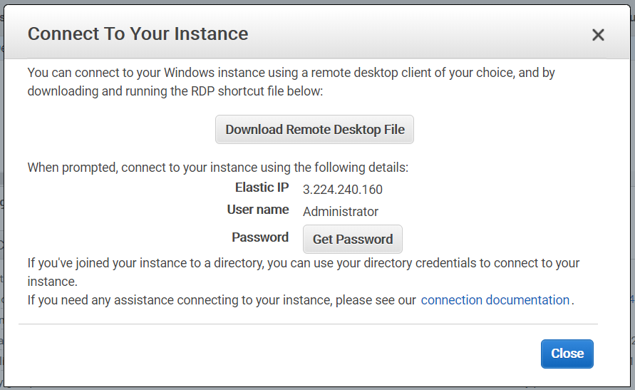
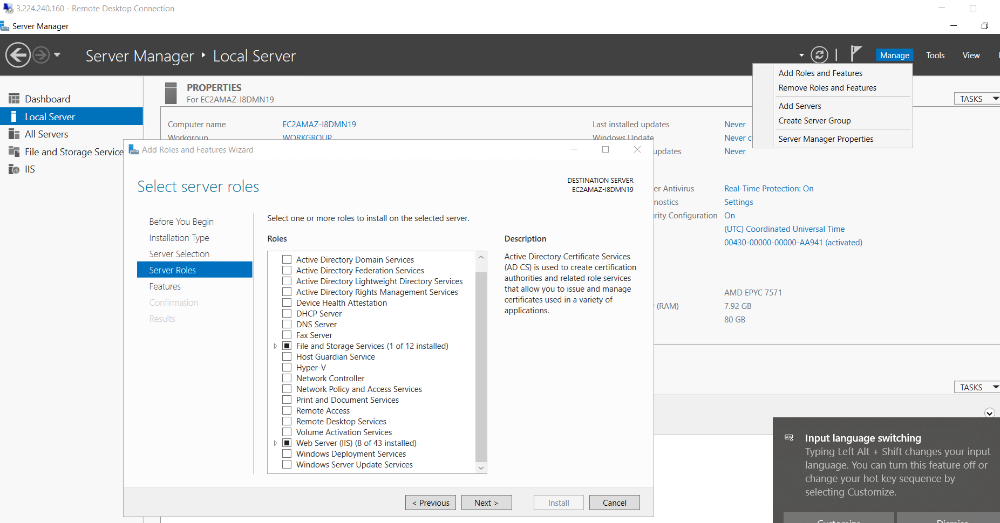
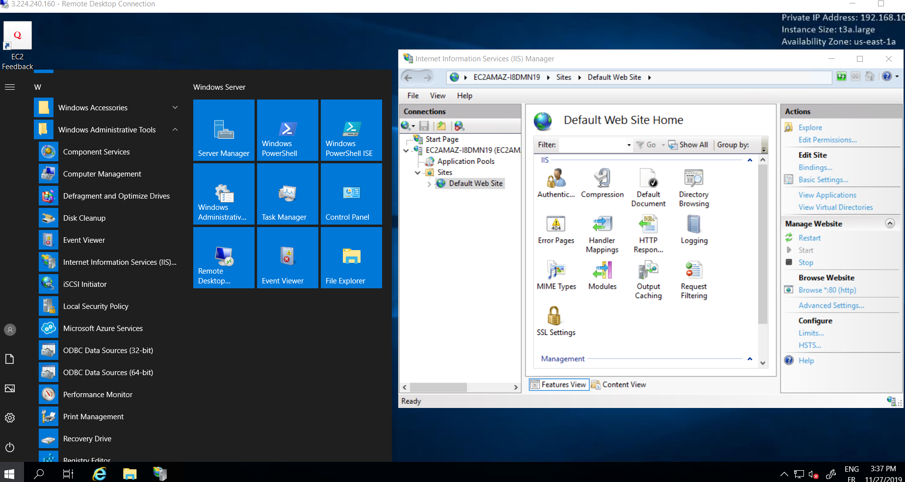
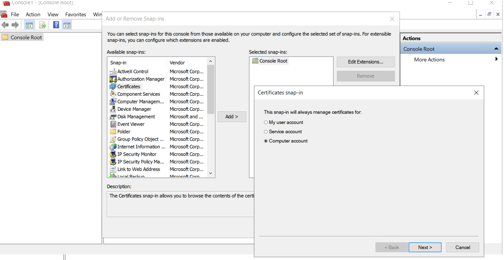
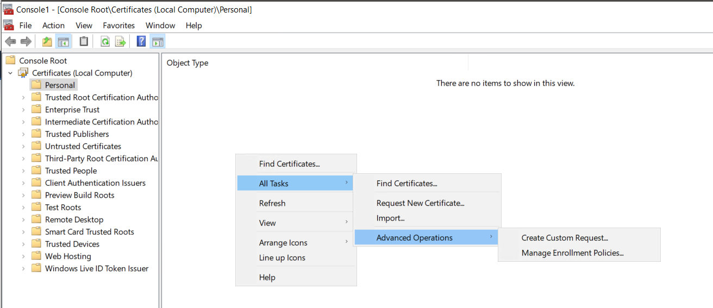
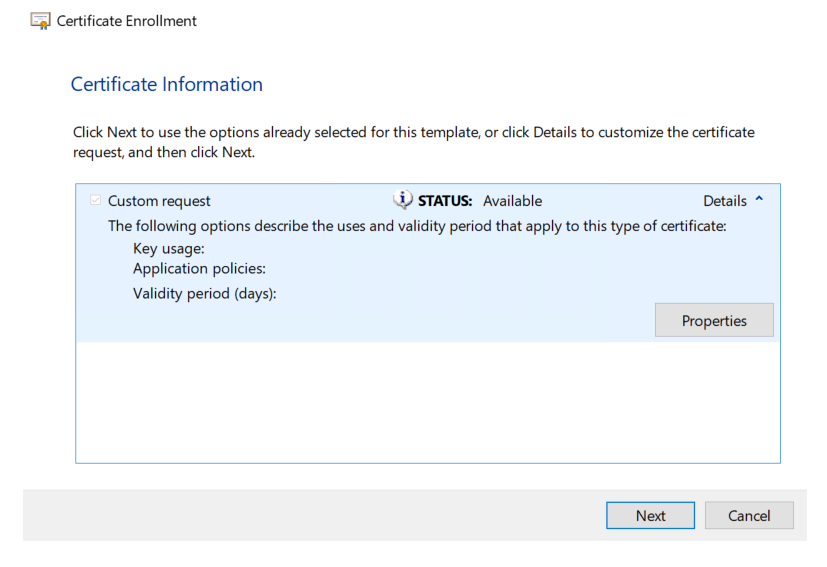
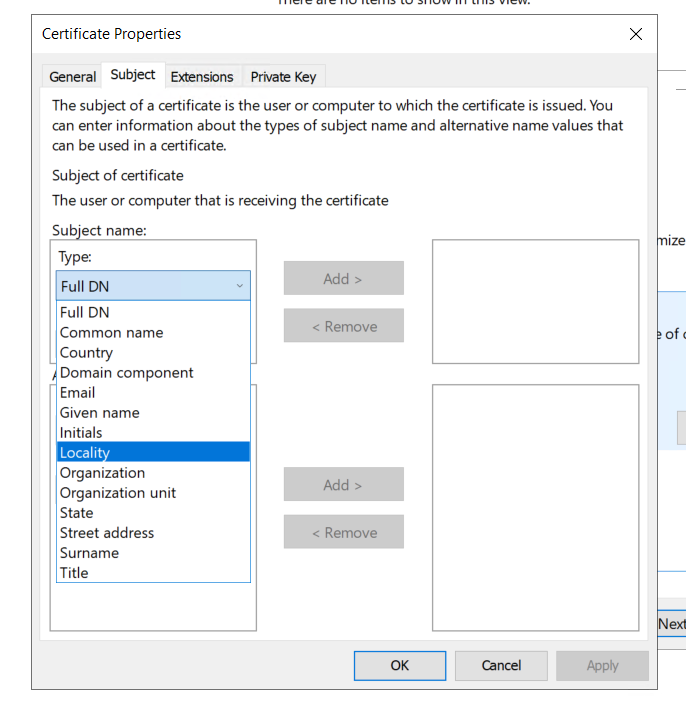
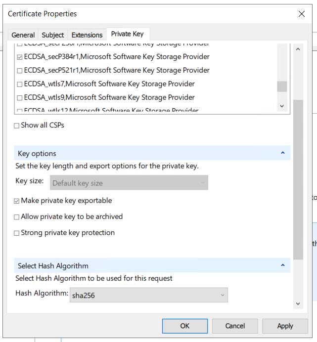
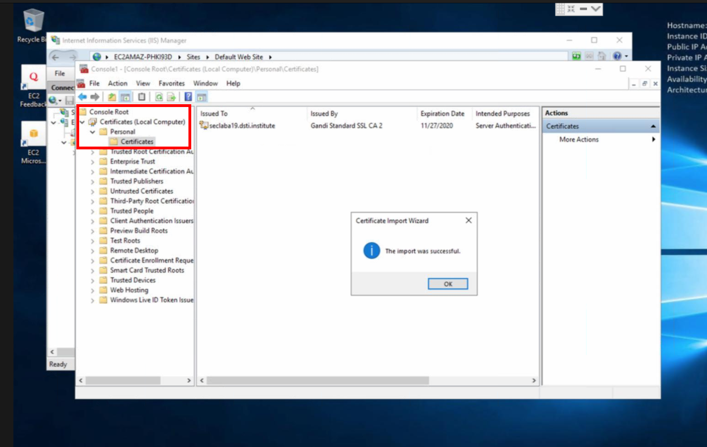
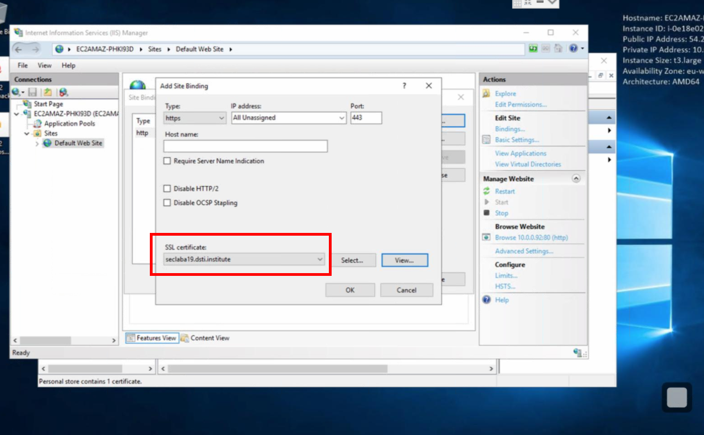

# AWS Deploy new webservice with encryption (Windows based)

## Architecture

- **VPC**
  - IGW
  - Public subnet
  - Route table subnet -> IGW
- **EC2 Instance** (Windows base 2019 - Free tier)
  - T3.large - 80Gb 
  - Security group (Firewalling)
    - RDP (TCP:3389) from 0.0.0.0/0 - (not SSH - windows machine)
    - HTTP (TCP:80) from 0.0.0.0/0
    - HTTPS (TCP:443) from 0.0.0.0/0
  - Attach Elastic IP
- **Route 53:**
  - not accessible with AWS training account
  - DNS (UDP:53)

## Connect via RDP

- Instance / Connect

- Get the password using private key.

- Connect through RDP on windows
- Accept self signed Certificate

## Application layer: Windows Server

- Server manager

  - Add roles and features
  - In server roles: Select Web Server (IIS)
  - Install

  

  

- Administrative tools / IIS / Default website

  - Default web site: right click / bindings:

    *A web service must be bound to private IP Address and port*

    - Site binding / Add site binding  for 80 / 443 to private IP

    *Public IP Binding done at AWS console level*

  - Can change location of files in right click / bindings

    

## Try connection (http)

- in web browser: http://<public IP> (no certificate yet for https)

## Encryption certificate

### Create CSR (certificate customer request)

#### Generate CSR via MS console: "mmc"

- File / "add/remove snap ins"

  - certificates snap in

    - computer account (IIS looks for certificates here)

    - 

      

- in personal (folder)

  - right click all tasks / create customer request

    

  - next next next

    

  - certificate information / properties / subject (mandatory fields)

    - common name

    - country

    - organization

    - organization unit

    - email

    - locality

    - state

      

  - private key

    - select cryptographic service provider (CSP) you want to use:

      - ECDH_secP384r1... (for example)

    - Key options

      - Make private key exportable

    - select Hash algorithm

      - sha256

        

  - OK

  - Save CSR file in <folder>/<file csr>

#### Buy certificate

​	Gandi.net

	- login
	- ... buy, paste your CSR

 - select validation method
   - via DNS: add DNS CNAME entry in route 53
     - (can check if CNAME entry is propagated: MXtoolbox.com /  CNAME lookup)

Once generated - download CRT file

#### Import Certificate

​	MMC CONSOLE / personal certificates / import

#### Add binding

in IIS / bindings

