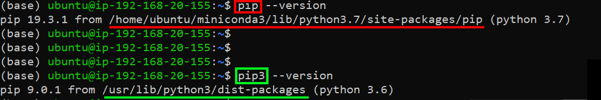

# Jupyter / Python / Venv setup


## Initital setup

- Create EC2 instance using AMI Ubuntu 18.04 Server, publicly accessible
- in Security Group: open port 8888 from anywhere
- connect trough ssh


## Install Conda

- **1st thing** always: update

```bash
sudo apt-get update -y
```

- Install mini-conda

```bash
wget https://repo.anaconda.com/miniconda/Miniconda3-latest-Linux-x86_64.sh
```

```bash
sh Miniconda3-latest-Linux-x86_64.sh
```

- *Follow instructions / restart terminal*


## Install / Create virtual environments (using conda)

- Create virtual environment with python 3.6

  ```bash
  conda create -n <venv_name> python=3.6
  ```

- activate virtual environment

  ```bash
  conda activate <venv_name>
  ```

- Deactivate virtual environment

  ```bash
  conda deactivate
  ```

- List existing environments

  ```bash
  conda env list  
  ```

- Remove virtual environment (deactivate first)

  ```bash
  conda env remove --name <venv_name>
  ```


## Install Jupyter

- install Jupyter

  ```bash
  pip install jupyter
  ```

- Launch Jupyter notebook (default binding is 127.0.0.1:8888)

  ```bash
  jupyter notebook --ip=0.0.0.0
  ```

- Run with **nohup** (no more link to terminal - stay alive even if terminal is closed)

  ```bash
  nohup jupyter notebook --ip=0.0.0.0 &
  ```

- Get the token

  ```bash
  cat nohup.out
  ```

- Check running Jupyter notebooks

  ```bash
  jupyter notebook list
  ```

- Stop running Jupyter notebook

  ```bash
  jupyter notebook stop 8888
  ```


## Add kernel to Jupyter

- In your virtual environment, Install in ipykernel (if needed)

  ```bash
  conda install ipykernel
  ```
  
- create linked kernel in Jupyter

  ```bash
  python3 -m ipykernel install --user --name=<name_in_jupyter>
  ```

- list kernel installed

  ```bash
  jupyter kernelspec list
  ```

- remove kernel

  ```bash
  jupyter kernelspec uninstall <name_in_jupyter>
  ```


## Get virtual environment installed packages

- get the list of installed packages in current virtual environment and save it to file

  ```bash
  pip freeze > requirements.txt
  ```

- install packages from requirements.txt in another virtual environment

  ```bash
  pip install -r requirements.txt
  ```


## WARNING !!!

In Conda virtual environment use pip not pip3 !!!




