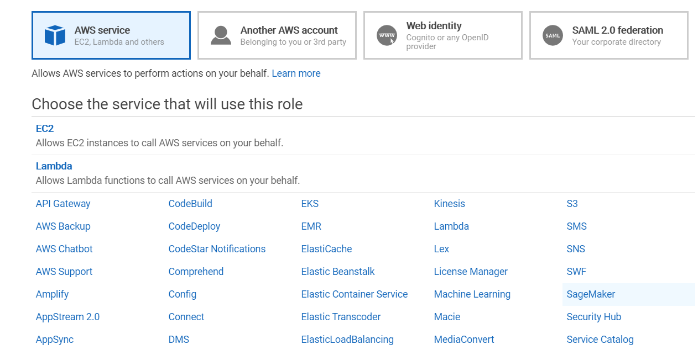

# AWS SageMaker

### Create SageMaker Notebook

- Create if not exiting, IAM role for Sagemaker

  

  

  

- Clone public git repository (GitLab from Julien Simon - lot of resources... to be checked.)

  https://gitlab.com/juliensimon/dlnotebooks.git

- Launch... wait a bit... Ready

- Just open notebook 

Very easy...

