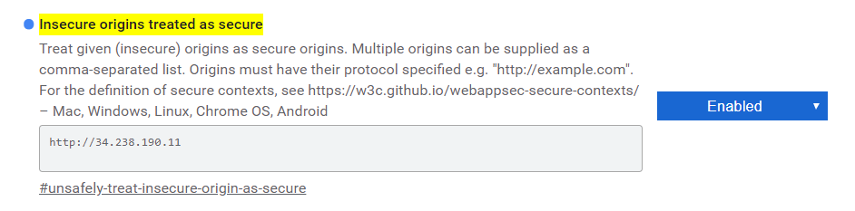
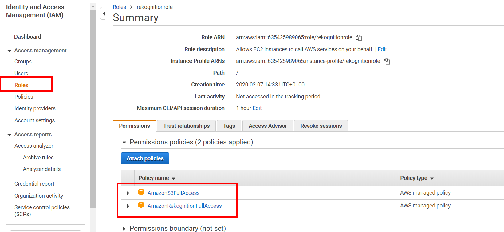
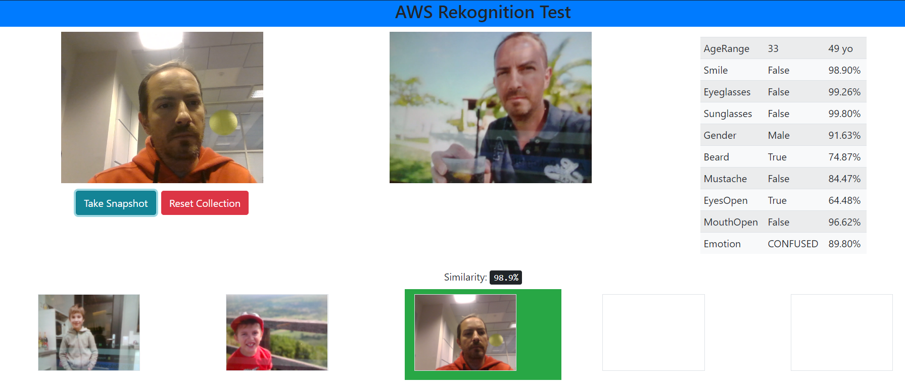

# Use AWS Rekognition


## Use case:

- html webpage to take a picture using webcam
- upload picture to S3 bucket
- use facial analysis to extract attributes from pictures (show it) - only **one** face on image
- keep up to 5 pictures in collection
- check for each screenshot if it exists in collection

## Architecture:

- Front end web server using **nginx**: 

  - t2.micro ubuntu server 18.04 ami
  - index.html / static (with css, js files)

- Backend processing using **flask**:

  - t2.micro ubuntu server 18.04 ami
  - rekognition api use of images


*For this Test Backend and Frontend are on the same machine (to avoid the use of load balancer to redirect to backend on private subnet)*

## Setup Frontend server:

- Security group: open port 22 and 80.

- Install nginx server

  ```bash
  sudo apt update
  sudo apt install nginx
  ```

- Clone github repository

  ```
  git clone https://github.com/terman37/AWS-tutorials.git
  ```

- Change default nginx server config

  ```bash
  sudo rm /etc/nginx/sites-enabled/default
  sudo cp ~/AWS-tutorials/09-Rekognition/frontend/frontend.com.conf /etc/nginx/sites-enabled/
  sudo nginx -s reload
  ```

  #### Trick (allow insecure website to use webcam in chrome)

  - Navigate to:

    > chrome://flags/#unsafely-treat-insecure-origin-as-secure

  - Enable feature and add public ip adress of frontend server

    


## IAM Role:

- Create an IAM role that will be used for backend to access rekognition and S3
  - Attach policies:
    - AmazonS3FullAccess
    - AmazonRekognitionFullAccess




## Setup Backend Server:

- Security group: open port 22 and 5000.

- IAM role:

  - attach previously created IAM role to EC2 instance

- Install miniconda:

  ```bash
  sudo apt update
  wget https://repo.anaconda.com/miniconda/Miniconda3-latest-Linux-x86_64.sh
  sh Miniconda3-latest-Linux-x86_64.sh
  ```

- Exit and reconnect to ssh

- Create virtual environment (named flask)

  ```bash
  conda create -n flask python=3.7
  conda activate flask
  ```

- Install Flask

  ```bash
  pip install Flask
  pip install flask_cors
  pip install boto3
  ```

- Clone github repository

  ```bash
  git clone https://github.com/terman37/AWS-tutorials.git
  ```

- Setup AWS config for boto3

  ```
  mkdir ~/.aws
  ```
  
  ```bash
  nano ~/.aws/config
  ```
  
  - should look like this:
  
    ```
    [default]
    region = us-east-1
    ```
  
- Run Flask app

  ```bash
  python ~/AWS-tutorials/09-Rekognition/backend/myapp.py
  ```


## Test it !

- Before to launch:

  - Put frontend IP in chrome to allow webcam

    > chrome://flags/#unsafely-treat-insecure-origin-as-secure
  
  - Do not forget to launch Flask test server

    ```
bash ~/AWS-tutorials/09-Rekognition/launch_backend.bash
    ```
    
  
- Test frontend access in chrome at [http://Frontend-PublicIP](http://<PublicIP>)

  should look like this: except the face :-)

