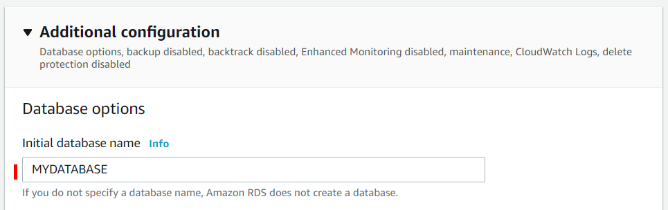
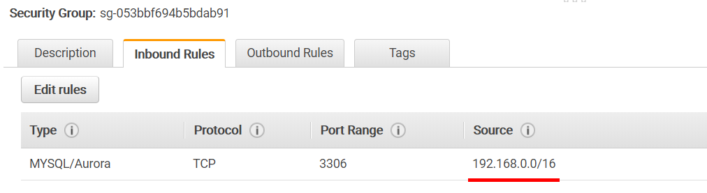
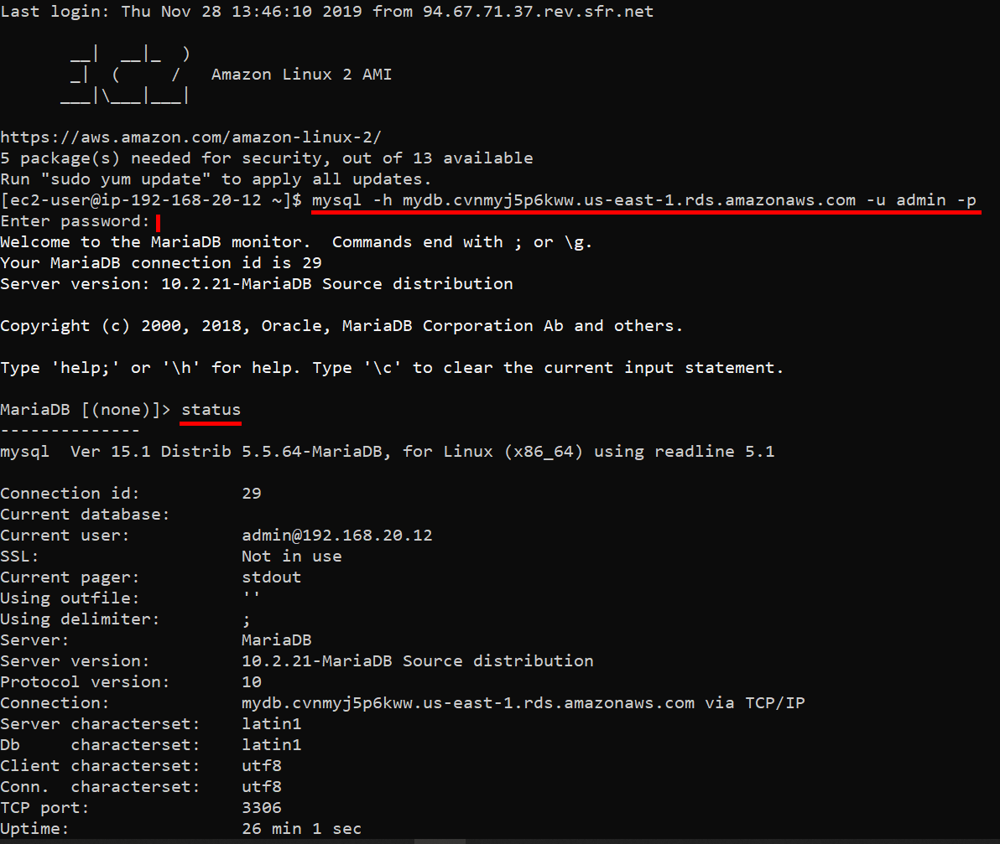
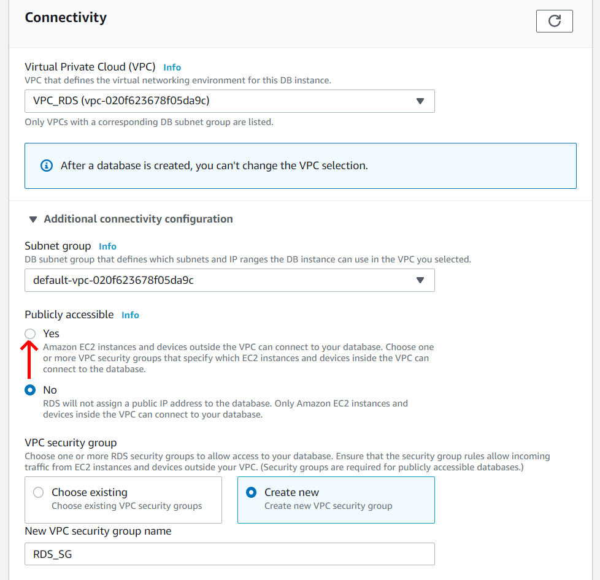

# AWS RDS setup and access

## 1. Database not publicly accessible

### Architecture

#### VPC

- IGW
- Subnet1 **Private** in AZ1
- Subnet2 **Private** in AZ2 (different from AZ1)
- Subnet3 **Public**
  - Route table: RT-table 
    `-> add 0.0.0.0/0 to IGW`

#### RDS instance

- See create database instance below

#### EC2 Instance

- belongs to Subnet3

- Public IP 

- SG1:

  > - allow Inbound SSH from local
  > - allow Outbound All traffic


### Create Database (not publicly accessible)

- Create database (example MariaDB)


- Give db instance_name, username and password


- select VPC / Create new security group, give name


- set a name for database (if needed/wanted)




##### By Default Security group is created only for your current IP (Source)


To be able to connect, it needs to be changed:




### Connect to DB (command line)

- Connect to EC2 instance via ssh:

```bash
ssh -i key.pem ec2-user@<public IP>
```

- On EC2, if needed, Install MySQL Client to connect remotely

```bash
sudo yum install mysql
```

- find RDS database endpoint:

  


- connect to database

```bash
mysql -h <endpoint> -u username -p
```

- looks like this (in MariaDB you can use `status` to get information)



- Connect to a database:

  ```sql
  connect DataBaseName
  ```

- Useful commands:

  ```sql
  SHOW TABLES;
  DESCRIBE table;
  DROP TABLE table;
  ```

- Create table (SQL):

  ```sql
  CREATE TABLE table (id int NOT NULL AUTO_INCREMENT, fristname VARCHAR(20), lastname VARCHAR(20));
  ```

- Insert:

  ```sql
  INSERT INTO mytable (firstname,lastname) VALUES ("Anthony","Jourdan");
  ```

  

## 2. Create Database (publicly accessible)

### Architecture

#### VPC

- IGW
- Subnet1 in AZ1
- Subnet2 in AZ2 (different from AZ1)

#### RDS instance

- **Enable** DNS resolution and DNS hostnames for your VPC

  

- **Same** as not publicly accessible except:



- **Be careful with SG !!!**

  

- Subnet1 and 2 (for RDS) should be public

  - Route table: RT-table 
    `-> add 0.0.0.0/0 to IGW`


### Connect to DB (using MySQL workbench)

- HostName = <endpoint>, and insert credentials.


### Connect to DB (using Python)

- Install SQLAlchemy, pymysql packages

  ```bash
   pip install sqlalchemy 
   pip install sqlalchemy-utils
   pip install pymysql 
  ```

- Test with simple python script

  ```python
  # Imports
  from sqlalchemy import create_engine
  from sqlalchemy_utils import database_exists, create_database
  
  # Create connection string
  connection_string = "mysql+pymysql://<user>:<passwd>@<endpoint>:3306/<DB Name>"
  
  # Create an engine to <DB Name>
  engine = create_engine(connection_string)
  
  # Check if DB exists otherwise create it.
  if not database_exists(engine.url):
      create_database(engine.url)
  
  # Get the table names
  print(engine.table_names())
  
  # Create a connection on engine
  connection = engine.connect()
  
  # Build select statement
  stmt = 'SELECT * FROM mytable2'
  
  # Execute the statement and fetch the results: results
  results = connection.execute(stmt).fetchall()
  
  # Print results
  print(results)
  ```

  


