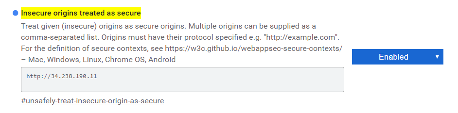

# Use AWS Rekognition


## Use case:

- html webpage to take a picture using webcam or file upload button

- upload picture to S3 bucket
- use facial analysis to extract attributes from pictures (show it)
- use face comparison to compare with previous image and check if same face is on picture


## Architecture:

- front end web server using **nginx**: 

  - t2.micro ubuntu server 18.04 ami
  - index.html / static (with css, js files)

- backend processing using **flask**:

  - t2.micro ubuntu server 18.04 ami
  - rekognition api use of images

  

## Setup Frontend server

- Security group: open port 22 and 80.

- Install nginx server

  ```bash
  sudo apt update
  sudo apt install nginx
  ```

- clone github repository

  ```
  git clone https://github.com/terman37/AWS-tutorials.git
  ```

- change default nginx server config

  ```bash
  sudo rm /etc/nginx/sites-enabled/default
  sudo cp ~/AWS-tutorials/AWS-Rekognition/frontend/frontend.com.conf /etc/nginx/sites-enabled/
  sudo nginx -s reload
  ```

  #### Trick (allow insecure website to use webcam in chrome)

  - navigate to:

    [chrome://flags/#unsafely-treat-insecure-origin-as-secure](chrome://flags/#unsafely-treat-insecure-origin-as-secure)

  - enable feature and add public ip adress of frontend server

    

- Test frontend access in chrome at [http://<PublicIP>](http://<PublicIP>)

## Setup Backend Server

- Security group: open port 22 and 5000.

- install miniconda:

  ```bash
  sudo apt update
  wget https://repo.anaconda.com/miniconda/Miniconda3-latest-Linux-x86_64.sh
  sh Miniconda3-latest-Linux-x86_64.sh
  ```

- exit and reconnect to ssh

- create virtual environment (named flask)

  ```bash
  conda create -n flask python=3.7
  conda activate flask
  ```

- install Flask

  ```bash
  pip install Flask
  pip install flask_cors
  pip install boto3
  ```

- clone github repository

  ```bash
  git clone https://github.com/terman37/AWS-tutorials.git
  ```

- run Flask app

  ```bash
  python ~/AWS-tutorials/AWS-Rekognition/backend/myapp.py
  ```


TODO

​	pip install boto3

​	mkdir ~/.aws

​	sudo nano ~/.aws/credentials

​	sudo nano ~/.aws/config

​	

​	client = boto3.client('s3')